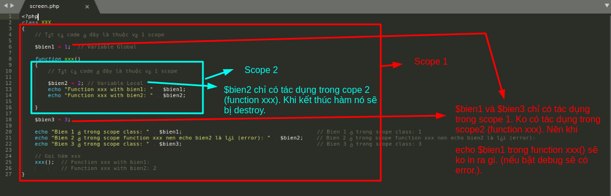

# PHP

> ##### Before or After readed this post. You can read more in [OOP5](http://php.net/manual/en/oop5.intro.php)

1. Variables Scope and keyworks
2. Refernce
3. Short syntaxs
4. Namespace (5.3)
5. Traits (5.4)
6. Autoloading (5.0)
7. PSR
8. Concepts in ÔP
9. Design Patterns
10. DI (Dependency Injection) and IoC (Inversion of Control)
11. SOLID

# -------------------  Start --------------------

## 1. Variables Scope and keyworks

### 1.1- Variables Scope (Phạm vi của biến):
Reference: [php variables](https://www.w3schools.com/php/php_variables.asp)

+ global (Biến toàn cục)
+ local ( Biến cục bộ)
+ static ( Biến tĩnh)

```
Hi all,

Đây có lẽ là kiến thức rất rất quan trọng mà ở trong bất kỳ một ngôn ngữ nào bạn cũng phải biết.

Scope là gì? Scope dịch ra là "phạm vi". 1 "phạm vi" chính là 1 khối code nằm trong dấu ngoặc nhọn {} .

Khái niệm này giống hệt ở trong javascript .

VD về scope:
class XXX
{
    // Tất cả code ở đây là thuộc về 1 scope

    $bien1 = 1;  // Variable Global

    function xxx()
    {
        // Tất cả code ở đây là thuộc về 1 scope

        $bien2 = 2; // Variable Local
        echo "Function xxx with bien1: " . $bien1;
        echo "Function xxx with bien2: " . $bien2;

    }

    $bien3 = 3;

    echo "Bien 1 ở trong scope class: " . $bien1;                                         // Bien 1 ở trong scope class: 1
    echo "Bien 2 ở trong scope function xxx nen echo bien2 là lỗi (error): " . $bien2;    // Bien 2 ở trong scope function xxx nen echo bien2 là lỗi (error):
    echo "Bien 3 ở trong scope class: " . $bien3;                                         // Bien 3 ở trong scope class: 3

    // Gọi hàm xxx
    xxx();  // Function xxx with bien1:
            // Function xxx with bien2: 2
}
```
# 
```
Phạm vi của biến liên quan đến code flow.

Một biến chỉ có thể có tác dụng ở trong hàm(function), hay trong 1 class, hay ở trong bất kỳ đâu ở trong file code.

- Nếu muốn biến global có thể dùng đc trong function xxx()

thì ta khai báo biến global đó với từ khóa global ( hoặc dùng $GLOBALS['ten_bien_global']]] )trong hàm là đc.
Ex 1:
<?php
$x = 5;
$y = 10;

function myTest() {
    global $x, $y;
    $y = $x + $y
}

myTest();
echo $y; // outputs 15
?>

Ex 2:
<?php
$x = 5;
$y = 10;

function myTest() {
    $GLOBALS['y'] = $GLOBALS['x'] + $GLOBALS['y'];
}

myTest();
echo $y; // outputs 15
?>

Với PHP có 3 kiểu phạm vi biến: global, local, static

+ Global (Biến toàn cục) và Local (Biến cục bộ) các bạn có thể xem hình ở trên

+ Static : Đây là kiểu biến giống với local (biến cục bộ). Nhưng static sẽ không bị xóa khi kết thúc hàm.

Nó là biến tĩnh lên gía trị sẽ ko bị xóa và luôn luôn lưu trữ theo gía trị trước đó.

Chúng ta sẽ xem ví dụ này để hiểu nha:

Ví dụ cho local:
<?php
    function Test()
    {
        $x = 0; // Biến local
        echo $x;
        $x++;
    }

    // Goi ham Test
    Test();  // Kết quả: 0

    // Goi ham Test lần nữa
    Test(); // Kết quả: 0
?>

Ví dụ cho static:
<?php
    function Test()
    {
        static $x = 0; // Biến static
        echo $x;
        $x++;
    }

    // Goi ham Test
    Test();  // Kết quả: 0

    // Goi ham Test lần nữa
    Test(); // Kết quả: 1
?>
```

### 1.2- Keyworks:

+ public, protected, private, static, final
+ this, self

- public, protected and private được gọi là visibility.

- public: có phạm vi cộng đồng. nghĩa là có thể truy cập ở bất kì đâu.
- protected: có phạm vi trong class chứa nó và class kế thừa class chứa nó.
- private: có phạm vi chỉ trong class chứa nó

- static: biến tĩnh, hàm tĩnh.

- final: final class là class cuối cùng. nghĩa là sẽ ko có 1 class nào kế thừa từ nó (Nó vô sinh.).
Hoặc final function thì nó sẽ ko thể override ở class kế thừa class chứa nó.
=> tránh trường hợp định nghĩa 1 hàm trùng tên với hàm ở lớp cha ( hàm ở lớp cha là final function xx(){})

- this: chỉ đối tượng
- self: chỉ chính class đó (class có function static, biến static)

## 2. Reference


## 3. Short syntaxs

- Array: [] (5.4)

## 4. Namespace (5.3)

## 5. Traits (5.4)

## 6. Autoloading (5.0)

## 7. PSR

- PSR-1: Basic Coding Standard

- PSR-2: Coding Style Guide

- PSR-3: Logger Interface

- PSR-4: Autoloading Standard

- PSR-6: Caching Interface

- PSR-7: HTTP Message Interface

- PSR-11: Container Interface

- PSR-13: Hypermedia Links

- PSR-16: Simple Cache

Above PSR Standards is ACCEPTED.

## 8. Concepts in OOP

- Interface

- Abstraction

- Encapsulation

- Inheritance

- Polymophirsm

- Overloading

...

## 9. Design Patterns


## 10. DI (Dependency Injection) and IoC (Inversion of Control)

## 11. SOLID

- Single responsibility principle

- Open/Closed principle

- Liskov substitution principle

- Interface segregation principle

- Dependency inversion principle
